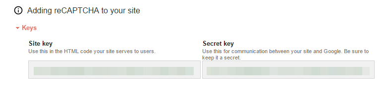

# reCAPTCHAv2-sample

[google reCAPTCHA v2](https://www.google.com/recaptcha/intro/invisible.html) sample code written in python3

# Install & Run

- Installation:

```
$ git clone https://github.com/vazrupe/reCAPTCHAv2-sample.git
$ cd reCAPTCHAv2-sample
$ pip install -r requirements.txt
```

- Configuration



edit `config.py`

```
recaptcha_sitekey = 'YOUR_SITE_KEY'
recaptcha_secretkey = 'YOUR_SECRET_KEY'
```

- Run

```
$ python run.py
```

# License
MIT
